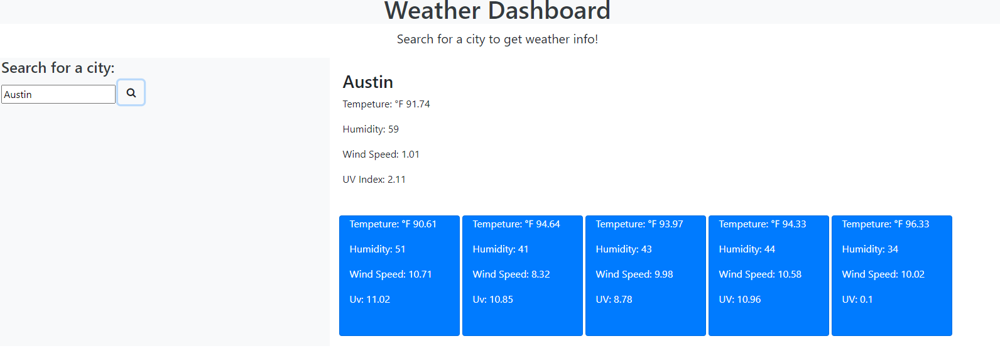

# Weather Dashboard

## Description
For this weeks homework we have to use third-party Apis in order to create a Weather Dashboard. We will also be using HTML and CSS along with JS that will allow the webpage to run smoothly in browser.

## User Story
For anyone that travels and wants to see the weather forecast for multiple cities thus allowing them to plan their accordingly. 

## Directions 
We are going to use the [OpenWeather One Call API](https://openweathermap.org/api/one-call-api) in order to be able to retrieve the weather data needed for our dashboard. We are also going to be using the local storage to store any locations searched and display them on the page.

## Acceptance Criteria
Given when dashboard has form inputs
When searching for a city and then user is presented with current + future conditions for that city. The city is also added to search history
User should be presented with the city name, date, an icon representation of weather conditions, the temperature, the humidity, the wind speed, and the UV index
When viewing the UV index the user is then presented with a color that indicates whether the conditions are favorable, moderate, or severe
When the user views future weather conditions for that city
Then they are presented with a 5-day forecast that displays the date, an icon representation of weather conditions, the temperature, the wind speed, and the humidity
When user clicks on a city in the search history
Then they are presented with current and future conditions for that city

## Mockup
The following image shows the web application's appearance and functionality:

()

The link to my deployed page is https://marissanancy.github.io/WeatherDash/
